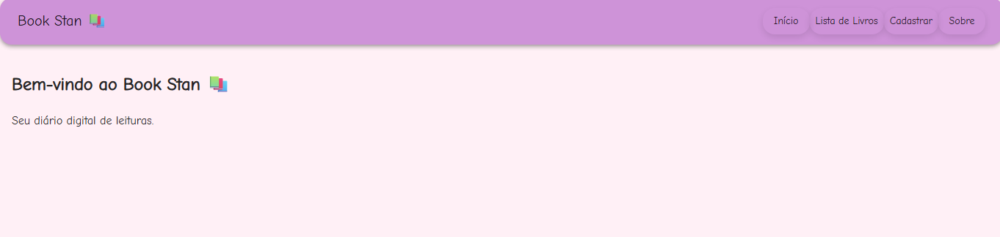
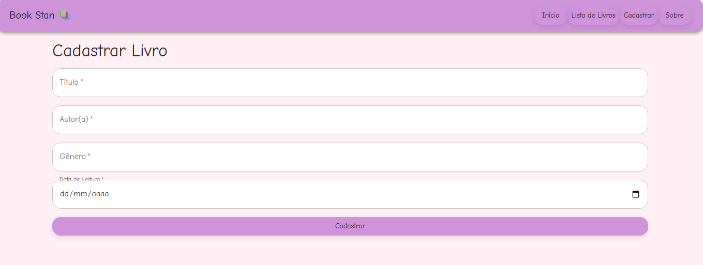
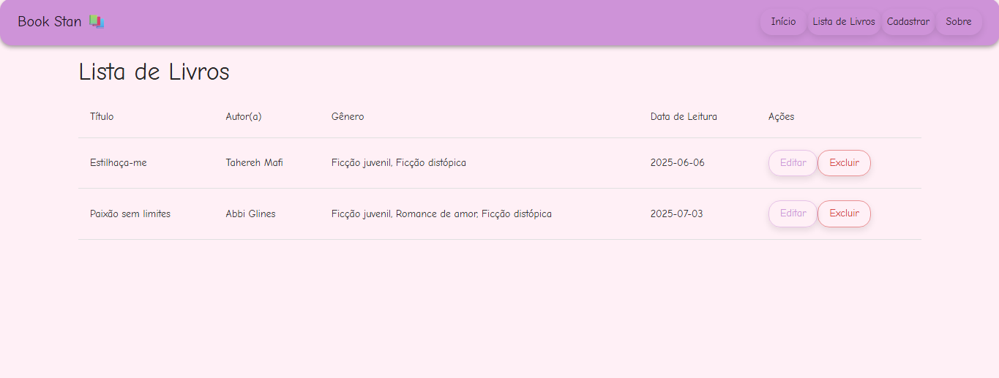
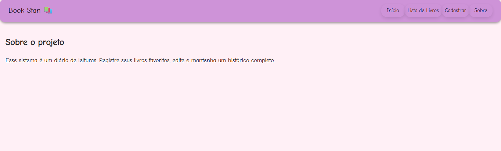

# 📚 Book Stan

**Book Stan** é um diário de leitura digital feito com React, onde o usuário pode cadastrar, visualizar, editar e excluir livros lidos. Este projeto foi desenvolvido para a disciplina de Desenvolvimento de Sistemas Front-End com foco na construção de um CRUD dinâmico conectado a uma API REST.

---

## 📦 Pré-requisitos

Antes de executar o projeto, certifique-se de ter o **Node.js** instalado na máquina.  
Você pode verificar com:

```bash
node -v
npm -v
```

Caso não tenha, baixe em: https://nodejs.org/

---

## 🚀 Como executar o projeto

1. **Clone ou extraia o projeto:**

```bash
git clone https://github.com/lalbuquerques/book-stan.git
# ou extraia o .zip fornecido
```

2. **Abra o terminal na pasta do projeto e instale as dependências:**

```bash
npm install
```

3. **Inicie o projeto React:**

```bash
npm start
```

4. Em outro terminal, inicie a API (separadamente), seguindo as instruções no repositório oficial:
https://github.com/adsPucrsOnline/DesenvolvimentoFrontend/tree/main/readingJournal-api

```bash
cd DesenvolvimentoFrontend/readingJournal-api
npm install
npm start
```

5. Acesse no navegador:

```
http://localhost:3000
```

> Obs: A pasta `node_modules` foi removida da entrega, pois será recriada com `npm install`.

---

## 🧩 Componentes e Páginas

### 🔹 `NavBar`
Barra de navegação fixa no topo da aplicação, com links para Início, Lista de Livros, Cadastro e Sobre.

### 🔹 `Cadastro.js`
Componente que funciona como **formulário dinâmico** para cadastro e edição de livros. Os campos obrigatórios são:
- Título
- Autor(a)
- Gênero
- Data de leitura

Utiliza `POST /books` para criar e `PUT /books` para editar (com o `id` incluso no corpo da requisição).

### 🔹 `ListaLivros.js`
Página que exibe todos os livros cadastrados em uma tabela, permitindo **exclusão (DELETE)** e **edição (via botão de navegação)**.

### 🔹 `Home.js` e `Sobre.js`
Páginas estáticas de apresentação e informações do projeto.

---

## 🗂️ Estrutura do projeto

```
src/
├── components/
│   └── NavBar/
│       └── NavBar.js
├── pages/
│   ├── Cadastro.js
│   ├── Cadastro.test.js
│   ├── Home.js
│   ├── Home.test.js
│   ├── ListaLivros.js
│   └── Sobre.js
├── services/
│   └── api.js
├── App.js
├── index.js
└── setupTests.js
```

---

## ✅ Como rodar os testes

O projeto utiliza **Jest + React Testing Library** para testes unitários de componentes.

Para executar todos os testes:

```bash
npm test
```

Ou, para rodar um teste específico:

```bash
npm test Cadastro
```

### ✅ Testes implementados:

- `Home.test.js`: verifica se o título e subtítulo da página inicial são renderizados.
- `Cadastro.test.js`: testa se os campos do formulário são exibidos corretamente e se os dados são preenchidos.

---

## 🔄 Integração com API (Axios)

A aplicação se conecta à [readingJournal-api](https://github.com/adsPucrsOnline/DesenvolvimentoFrontend) para persistência dos dados dos livros.

### Endpoints utilizados:

| Método | Rota            | Descrição                                 |
|--------|------------------|--------------------------------------------|
| GET    | `/books`         | Lista todos os livros                      |
| GET    | `/books/:id`     | Retorna um livro específico                |
| POST   | `/books`         | Cadastra um novo livro                     |
| PUT    | `/books`         | Atualiza um livro existente (id no corpo) |
| DELETE | `/books/:id`     | Exclui um livro                            |

> ✅ **Observação:** Conforme o enunciado da fase, a atualização de um livro deve ser feita com `PUT /books`, e o `id` do livro deve ser enviado no corpo da requisição. O projeto segue exatamente esse comportamento, conforme implementado na API oficial `readingJournal-api`.

---

## 🧠 Decisões de desenvolvimento

- **Roteamento:** React Router foi usado para criar rotas simples e dinâmicas (ex: `/editar/:id`)
- **Gerenciamento de Dados:** Axios foi utilizado para todas as operações com a API REST.
- **UI/UX:** Material-UI (`@mui/material`) foi escolhido por oferecer componentes visuais prontos e responsivos.
- **Teste de Componentes:** O Jest e a React Testing Library foram usados para garantir que os principais componentes funcionam corretamente.

---

## 🖼️ Imagens (prints de tela)

```md
### Página Inicial


### Cadastro de Livro


### Lista de Livros


### Informação do Site

```

---

Desenvolvido por **Larissa Albuquerque** 🦋